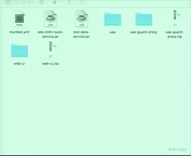
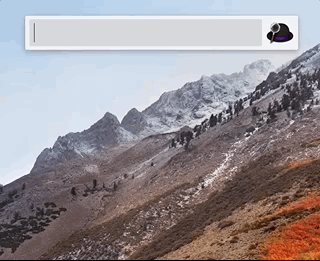

alfred-cloudfoundry
===================

This workflow should work with any platform exposing the [Clound Foundry API](https://apidocs.cloudfoundry.org/5.1.0/).

Note that *version 2* of the API is used by this workflow.

# To start

1. Download and install [Cloud-Foundry.alfred3workflow](https://github.com/fouadh/alfred-cloudfoundry/raw/master/Cloud-Foundry-0.1.0.alfred3workflow)

2. Configure the endpoint and your Cloud Foundry credentials (see in the **How to use** section)

3. Enjoy !

# How to use

Type cf to get a list of all the available commands.

When a list is presented, you can search for a specific element.

For any selected resource, press **Cmd+C** and get its JSON value copied in the clipboard.

A cache per resource (applications, routes, services, ...) is used to keep the resources obtained from Cloud Foundry: it is useful when you are looking for a specific resource
in a list. The data in a cache expire after 15 seconds.

If you're using a proxy, configure it in the **HTTP_PROXY** and **HTTPS_PROXY** environment variables.

Under the hood, this framework uses the [cf-client-python](https://github.com/cloudfoundry-community/cf-python-client) 
library to execute the requests to Cloud Foundry. 

### Setup Cloud Foundry endpoint

```
  cf setendpoint <endpoint>
```


### Setup Cloud Foundry credentials

```
  cf setcredentials <login> <password>
```

*Note:* the password is stored in the Keychain, not in clear.


### List applications


### Push an application (via a manifest)

Before pushing an application, a space must have been targeted.

- From the Finder

You can select a manifest file from the finder and use Alfred to push the associated application(s) in Cloud Foundry.



- From Alfred

Or you can find a manifest directly from Alfred before pushing the associated application(s).


### Start/Stop an application

Press **Cmd** and select an application to start (or stop) it depending on its state.

Note that starting an application may take a few moment so just be patient.


### Remove an application

Press **Shift** and select the application to remove.


### Restage an application

Press **Ctrl** and select the application to restage.

Note that this can be a lenghty operation since a droplet must be recreated on the platform.

### Get the stats of an application

For started applications, you can press the **Alt** key and press enter to retrieve its stats.

When the stats are obtained, press **Cmd+C** to save them in the clipboard.

### Get the recent logs of an application

For started applications, you can press the **Fn** key and press enter to retrieve its recent logs.

When the stats are obtained, press **Cmd+C** to save them in the clipboard.

### List routes


### Remove a route

Use the **Shift** key and select the route to remove.


### List services


### Create a service instance

List all the available services, press the **Cmd** key to select the service you want to create. Then, the list of
available plans will be listed: select the one you want to create. Then, enter the name of the service instance and Return.


### List services instances


### Remove a service instance

Press the **Shift** key and select the service instance to remove.


### Bind a service instance to an application

List the services instances and press the **Cmd** key to select the instance you want to bind. Then, the list of applications
will be listed: just select the one you want to bind with the previous selected service instance.


### List services bindings


### Remove a service binding

Use the **Shift** key to select a service binding to remove.


### List shared domains


### List private domains


### List spaces


### Target a space

Use the Cmd key to target a space: it will be used for push operations.


### List organizations



### List stacks


### List buildpacks


### List user provided services  


### List service brokers

### Remove a service broker

# Testing

## Unit tests

To run the unit test, execute the command:

```bash
./run-unit-tests.sh
```

## End to end tests

To execute the end to end tests for this workflow:

1. Install [nodejs](https://nodejs.org/en/) (tested with version 8.12.0). You can eventually use 
[nvm](https://github.com/creationix/nvm) to manage your node version.

2. Install and run [mountebank](http://www.mbtest.org) on port 2525 (which is normally the default)

```bash
npm install -g mountebank
mb
```

Ports 3001 and 4001 must also be available since they are used to stub UAA and the Cloud Foundry API server.

3. Execute the following command:

```bash
./run-e2e.sh
```